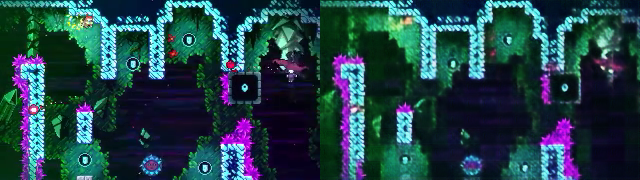
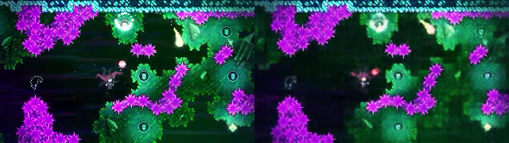
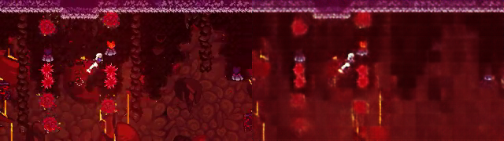

# Video genration model trained on Celeste gameplay fottage

Abstract:
---
- This work shows a working implementation and results of a video generation model trained on raw gameplay fottage of the game "Celeste". 
- We show empirical evidence of a working world-model that starts to capture game dynamics and shows strong indications of improvement with scale.
- The work is free under open-source and open-weights, MIT license access.

Overview:
---

Architecture:
- a VAE model is used to compress raw frame data into a latent respresentation
- a DiT model is then used to denoise a sequence of latent frames t
- the denoised latents are then decompressed using VAE to obtain generated frames

Data:
- [~4.5hr gameplay fottage](https://www.youtube.com/watch?v=z8r255LoVJc)
- 12fps (sub-sampled)
- 320x180x3 resolution (native game resolution)

VAE:
- ~57M param model
- ViT architecture
- `(3, 320, 180)` frame data -> `(220, 48)` mu and logvar latent representation
- x16.36 compression ratio
- ~$80 training cost (incl. experimentation)

Video model:
- ~255M param model
- DiT with Flow matching + Self forcing loss, RoPE
- 10-step auto-regressive generation using euler integration
- `(B, T, 220, 48)` -> `(B, T, 220, 48)` - trained with T=24 (sequence length)
- ~$120 training cost (incl. experimentation)

Training procedure:
---
- VAE was trained using simple pixel reconstruction loss with beta=0, after convergence, beta was gradually increased to the point where it started to ruin reconstruction quality
- DiT was trained using `T=24` and randomly sampled t (noise steps) and simple flow-matching loss (MSE) + self-forcing by partially (p=.25) training on generated denoised images of randomly sampled t.

Inference procedure:
---
- we encode the prompt video in a single batch using VAE to obtain mu and logvar
- we sample from posterior distribution to latent frame represenations
- we feed those to the DiT (clean frames with t=.95 to avoid over-confidence of generated frames) and add a noise frame (t=0) to be denoised
- we iteratively denoise the batch using euler integration (10 steps) to arrive at a denoised next frame
- we appened the denoised frame and continue

Results:
---
VAE reconstruction: 
-----

   
   
  

**Conclusion**: the VAE is able to reconstruct frames with enough fidelity to capture the dynamic features of the scene (player, enemies and moving pieces)

Video generation:
-----

Below is the result of video contiuation generation (the first half is grouth truth fottage, the second half is generated by the model):

   
   
  Figure 1. (mid-training) The model starts to exhibit sings of object permanence and game dynamics
    
   
  Figure 2. The model exhibits object permanence and starts to exhibit signs of player movement prediction
    
   
  Figure 3. The model exhibits signs of camera movement understanding

**Conclusion**: the model shows signs of capturing the dynamic aspects of the game in its world model (scene translation, dynamic objects movement, player movement); this proves the basic model works, and gives stong indication of improved results as scale increases.

Reproducting the results locally:
---
1. `git clone https://github.com/tsuberim/celeste` - download code
2. `hf download --local-dir ./models tsuberim/celeste` - download VAE & DiT weights
3. `python3 -m venv .venv`, `source .venv/bin/activate`, `pip install -r requirements.txt` - install requirements
4. `python3 download.py https://www.youtube.com/watch?v=z8r255LoVJc` - download raw data
5. `py generate.py --prompt_video videos/z8r255LoVJc.mp4 --prompt_max_frames 10000` - generate a video from a randomly sampled prompt (T=16) from first 1k frames, outputs to `./generated_video.mp4`
6. `py generate.py --help` - for more options 

Futher directions:
---
- better and more high quality data
- latent action model to learng implicit actions from raw fottage
- RL agent using curiosity driven exploration intrinsic reward based on LAM
- perceptual loss to better learn character movement

File Structure:
---
The main files and directories in this repository are as follows:

- `generate.py`: Main script for generating videos using the trained models.
- `download.py`: Utility to download raw video data (YouTube links).
- `vae2.py`: **Current** implementation of the Variational Autoencoder (VAE) model. **Use this file; it supersedes `vae.py`.**
- `vae.py`: **Deprecated** VAE implementation. Please use `vae2.py` instead.
- `dit.py`: Implementation of the DiT model for video frame generation.
- `utils.py`: Helper functions and utilities used throughout the codebase.
- `dataset.py`: Scripts for loading, preprocessing, and handling datasets.
- `models/`: Contains pretrained VAE and DiT model weights (downloaded via HuggingFace).
- `requirements.txt`: Dependencies required to run the code.
- `videos/`: Folder containing downloaded and processed video data.
- `results/`: Outputs of samples, including images (.png) and videos (.mp4) displayed in the results section.
- `.venv/`: (Optional) Python virtual environment folder for dependencies.

You can explore each of these files and folders to understand the workflow and locate outputs/results. All primary logic is implemented in the Python files listed above, with additional supporting modules as needed.
  
**Note**: When working with the VAE, always use `vae2.py`, as `vae.py` is maintained only for backward compatibility and may be removed in the future.
